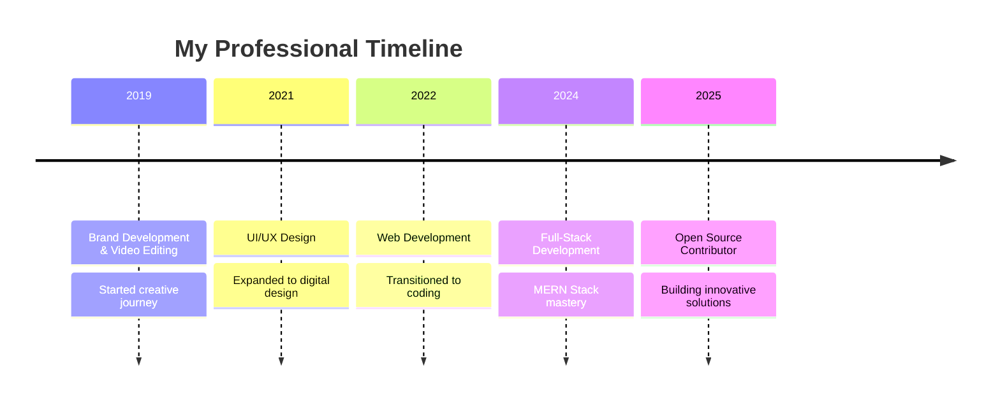

# Hi there, I'm Nalin Sandaruwan! 👋

  

## 🚀 About Me

> **Bridging the gap between creative design and innovative development**

I'm a passionate **Full-Stack Developer** currently pursuing my **Bachelor of Information and Communication Technology** at Uva Wellassa University. With **5 years of experience** in advertising and branding development, I bring a unique perspective to web development by combining creative design thinking with robust technical solutions.

- 🔭 Currently working on **SaaS platforms** and **modern web applications**
- 🌱 Deep diving into **MERN stack** and **Next.js** ecosystem
- 👯 Looking to collaborate on **open-source projects** and **innovative web solutions**
- 💬 Ask me about **Full-Stack Development**, **UI/UX Design**, or **Brand Development**
- 📧 Reach me at: **creationbynalin@gmail.com**

## 🛠️ Tech Stack & Tools

### 💻 Frontend Development

  

**Libraries & Frameworks:**
- ⚛️ React.js - Building interactive UIs
- 🚀 Next.js - Full-stack React framework
- 🎭 Framer Motion - Smooth animations and transitions
- 🎨 Tailwind CSS - Utility-first styling

### 🖥️ Backend Development

  

**Technologies:**
- 🟢 Node.js - Runtime environment
- ⚡ Express.js - Web application framework
- 🏗️ Nest.js - Progressive Node.js framework
- 🐘 PHP - Server-side scripting
- 🗄️ SQL & MongoDB - Database management

### 🎨 Design & Creative Tools

  

**Creative Suite:**
- 🎨 Adobe Photoshop - Photo editing & digital art
- 🎯 Adobe Illustrator - Vector graphics & logos
- 📐 Figma - UI/UX design & prototyping
- 🎬 After Effects - Motion graphics & animation
- 🎥 Premier Pro - Video editing & production

## 📊 GitHub Stats

  
   
  
   
  

## 🏆 GitHub Trophies

  

## 💼 Professional Journey

## 🤝 Let's Connect!

  

## ⚡ Fun Facts

- 🎨 Started my journey as a **brand developer and video editor** - still love combining design with logic!
- 🚀 Passionate about creating **pixel-perfect** interfaces with **smooth animations**
- 🌟 Believe that **great code** should be as beautiful as **great design**
- 📚 Always learning and exploring new technologies in the ever-evolving tech landscape

---

  
  
  **"Code is poetry written in logic, design is poetry written in pixels"** ✨

---
*This README is automatically updated with my latest GitHub activity*
